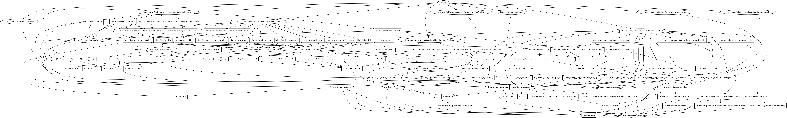

# POC EKS Karpenter

POC com o Karpenter utilizando Node Group gerenciado.

Group-less node provisioning: o Karpenter gerencia cada instância diretamente, sem o uso de mecanismos de orquestração adicionais, como grupos de nós. Isso permite que ele tente novamente em milissegundos em vez de minutos quando a capacidade não estiver disponível. Ele também permite que a Karpenter aproveite diversos tipos de instância, zonas de disponibilidade e opções de compra sem a criação de centenas de grupos de nós.


# In construction...

### Deploy app

Aplicacao de teste na path /app, para realizar o deploy é necessário ter o kubectl instalado, para instalar siga a documentacao: https://kubernetes.io/docs/tasks/tools/

Após a instalacão do cluster, é necessário realizar configurar o contexto do cluster, executando o comando abaixo:

```bash
$ aws eks update-kubeconfig --region us-east-1 --name <nomedocluster>
```

Caso queira saber onde fica o contexto do cluster, acesse o arquivo em `~/.kube/config`.

### Realizando o deploy

```bash
$ kubectl apply -f app/inflate.yaml
```

Neste momento ele irá criar somente o deployment

```bash
$ kubectl get deploy
```

Agora vamos escalar para 10 réplicas
```bash
$ kubectl scale deployment inflate --replicas 10 
```

### Logs Karpenter

Ao escalar os pods, o karpenter irá provisionar os nós novos, para acompanhar os logs, execute o comando abaixo:

```bash
k logs -f karpenter-5fd79b9db5-xtrrq -n karpenter
```

```bash
2022-11-14T05:08:23.992Z        INFO    controller.provisioning.cloudprovider   Launched instance: i-09feebdf4e833d81f, hostname: ip-172-31-2-158.ec2.internal, type: t3a.medium, zone: us-east-1a, capacityType: on-demand    {"commit": "5d4ae35-dirty", "provisioner": "karpenter"}
```

Agora vamos realizar o Scaling Down e acompanhar os logs do karpenter.

```bash
$ kubectl scale deployment inflate --replicas 0
```

```bash
2022-11-14T05:27:12.000Z        INFO    controller.node Triggering termination after 30s for empty node {"commit": "5d4ae35-dirty", "node": "ip-172-31-8-84.ec2.internal"}
2022-11-14T05:27:12.034Z        INFO    controller.termination  Cordoned node   {"commit": "5d4ae35-dirty", "node": "ip-172-31-8-84.ec2.internal"}
2022-11-14T05:27:12.290Z        INFO    controller.termination  Deleted node    {"commit": "5d4ae35-dirty", "node": "ip-172-31-8-84.ec2.internal"}
```

Após realizar o scaling down o `Node termination handler` irá desprovisionar as instâncias, logo abaixo os logs do `Node Termination Handler`:

```bash
022/11/14 05:09:46 INF Startup Metadata Retrieved metadata={"accountId":"223341017520","availabilityZone":"us-east-1a","instanceId":"i-09feebdf4e833d81f","instanceType":"t3a.medium","localHostname":"ip-172-31-2-158.ec2.internal","privateIp":"172.31.2.158","publicHostname":"ec2-44-203-247-185.compute-1.amazonaws.com","publicIp":"44.203.247.185","region":"us-east-1"}
2022/11/14 05:09:46 INF aws-node-termination-handler arguments: 
        dry-run: false,
        node-name: ip-172-31-2-158.ec2.internal,
        metadata-url: http://169.254.169.254,
        kubernetes-service-host: 10.100.0.1,
        kubernetes-service-port: 443,
        delete-local-data: true,
        ignore-daemon-sets: true,
        pod-termination-grace-period: -1,
        node-termination-grace-period: 120,
        enable-scheduled-event-draining: false,
        enable-spot-interruption-draining: true,
        enable-sqs-termination-draining: false,
        enable-rebalance-monitoring: false,
        enable-rebalance-draining: false,
        metadata-tries: 3,
        cordon-only: false,
        taint-node: false,
        json-logging: false,
        log-level: info,
        webhook-proxy: ,
        webhook-headers: <not-displayed>,
        webhook-url: ,
        webhook-template: <not-displayed>,
        uptime-from-file: ,
        enable-prometheus-server: false,
        prometheus-server-port: 9092,
        aws-region: us-east-1,
        queue-url: ,
        check-asg-tag-before-draining: true,
        managed-asg-tag: aws-node-termination-handler/managed,
        aws-endpoint: ,

2022/11/14 05:09:46 INF Started watching for interruption events
2022/11/14 05:09:46 INF Kubernetes AWS Node Termination Handler has started successfully!
2022/11/14 05:09:46 INF Started watching for event cancellations
2022/11/14 05:09:46 INF Started monitoring for events event_type=SPOT_ITN
```

<!-- BEGIN_TF_DOCS -->
## Requirements

| Name | Version |
|------|---------|
| <a name="requirement_terraform"></a> [terraform](#requirement\_terraform) | >= 1.3.3 |
| <a name="requirement_aws"></a> [aws](#requirement\_aws) | ~> 4.34.0 |
| <a name="requirement_helm"></a> [helm](#requirement\_helm) | ~> 2.7.1 |
| <a name="requirement_kubectl"></a> [kubectl](#requirement\_kubectl) | >= 1.7.0 |
| <a name="requirement_kubernetes"></a> [kubernetes](#requirement\_kubernetes) | ~> 2.14.0 |
| <a name="requirement_template"></a> [template](#requirement\_template) | >= 2.2.0 |
| <a name="requirement_tls"></a> [tls](#requirement\_tls) | ~> 4.0.3 |

## Providers

| Name | Version |
|------|---------|
| <a name="provider_aws"></a> [aws](#provider\_aws) | 4.34.0 |
| <a name="provider_helm"></a> [helm](#provider\_helm) | 2.7.1 |
| <a name="provider_kubectl"></a> [kubectl](#provider\_kubectl) | 1.14.0 |
| <a name="provider_kubernetes"></a> [kubernetes](#provider\_kubernetes) | 2.14.0 |
| <a name="provider_template"></a> [template](#provider\_template) | 2.2.0 |
| <a name="provider_tls"></a> [tls](#provider\_tls) | 4.0.4 |

## Modules

No modules.

## Resources

| Name | Type |
|------|------|
| [aws_ec2_tag.karpenter](https://registry.terraform.io/providers/hashicorp/aws/latest/docs/resources/ec2_tag) | resource |
| [aws_eks_addon.cni](https://registry.terraform.io/providers/hashicorp/aws/latest/docs/resources/eks_addon) | resource |
| [aws_eks_addon.coredns](https://registry.terraform.io/providers/hashicorp/aws/latest/docs/resources/eks_addon) | resource |
| [aws_eks_addon.kubeproxy](https://registry.terraform.io/providers/hashicorp/aws/latest/docs/resources/eks_addon) | resource |
| [aws_eks_cluster.master](https://registry.terraform.io/providers/hashicorp/aws/latest/docs/resources/eks_cluster) | resource |
| [aws_eks_node_group.this](https://registry.terraform.io/providers/hashicorp/aws/latest/docs/resources/eks_node_group) | resource |
| [aws_iam_instance_profile.nodes](https://registry.terraform.io/providers/hashicorp/aws/latest/docs/resources/iam_instance_profile) | resource |
| [aws_iam_openid_connect_provider.eks](https://registry.terraform.io/providers/hashicorp/aws/latest/docs/resources/iam_openid_connect_provider) | resource |
| [aws_iam_policy.console_policy](https://registry.terraform.io/providers/hashicorp/aws/latest/docs/resources/iam_policy) | resource |
| [aws_iam_policy.karpenter_policy](https://registry.terraform.io/providers/hashicorp/aws/latest/docs/resources/iam_policy) | resource |
| [aws_iam_policy.service_account](https://registry.terraform.io/providers/hashicorp/aws/latest/docs/resources/iam_policy) | resource |
| [aws_iam_policy_attachment.console_policy](https://registry.terraform.io/providers/hashicorp/aws/latest/docs/resources/iam_policy_attachment) | resource |
| [aws_iam_policy_attachment.karpenter_policy](https://registry.terraform.io/providers/hashicorp/aws/latest/docs/resources/iam_policy_attachment) | resource |
| [aws_iam_role.karpenter_role](https://registry.terraform.io/providers/hashicorp/aws/latest/docs/resources/iam_role) | resource |
| [aws_iam_role.master](https://registry.terraform.io/providers/hashicorp/aws/latest/docs/resources/iam_role) | resource |
| [aws_iam_role.node_group](https://registry.terraform.io/providers/hashicorp/aws/latest/docs/resources/iam_role) | resource |
| [aws_iam_role.service_account](https://registry.terraform.io/providers/hashicorp/aws/latest/docs/resources/iam_role) | resource |
| [aws_iam_role_policy_attachment.cloudwatch](https://registry.terraform.io/providers/hashicorp/aws/latest/docs/resources/iam_role_policy_attachment) | resource |
| [aws_iam_role_policy_attachment.cni](https://registry.terraform.io/providers/hashicorp/aws/latest/docs/resources/iam_role_policy_attachment) | resource |
| [aws_iam_role_policy_attachment.ecr](https://registry.terraform.io/providers/hashicorp/aws/latest/docs/resources/iam_role_policy_attachment) | resource |
| [aws_iam_role_policy_attachment.master-AmazonEKSClusterPolicy](https://registry.terraform.io/providers/hashicorp/aws/latest/docs/resources/iam_role_policy_attachment) | resource |
| [aws_iam_role_policy_attachment.master-AmazonEKSVPCResourceController](https://registry.terraform.io/providers/hashicorp/aws/latest/docs/resources/iam_role_policy_attachment) | resource |
| [aws_iam_role_policy_attachment.node](https://registry.terraform.io/providers/hashicorp/aws/latest/docs/resources/iam_role_policy_attachment) | resource |
| [aws_iam_role_policy_attachment.service_account](https://registry.terraform.io/providers/hashicorp/aws/latest/docs/resources/iam_role_policy_attachment) | resource |
| [aws_iam_role_policy_attachment.ssm](https://registry.terraform.io/providers/hashicorp/aws/latest/docs/resources/iam_role_policy_attachment) | resource |
| [aws_launch_template.karpenter](https://registry.terraform.io/providers/hashicorp/aws/latest/docs/resources/launch_template) | resource |
| [aws_launch_template.main](https://registry.terraform.io/providers/hashicorp/aws/latest/docs/resources/launch_template) | resource |
| [aws_security_group_rule.nodeport_eks](https://registry.terraform.io/providers/hashicorp/aws/latest/docs/resources/security_group_rule) | resource |
| [aws_security_group_rule.nodeport_eks_udp](https://registry.terraform.io/providers/hashicorp/aws/latest/docs/resources/security_group_rule) | resource |
| [aws_security_group_rule.rule_443](https://registry.terraform.io/providers/hashicorp/aws/latest/docs/resources/security_group_rule) | resource |
| [aws_security_group_rule.rule_53_tcp](https://registry.terraform.io/providers/hashicorp/aws/latest/docs/resources/security_group_rule) | resource |
| [aws_security_group_rule.rule_53_udp](https://registry.terraform.io/providers/hashicorp/aws/latest/docs/resources/security_group_rule) | resource |
| [aws_security_group_rule.rule_80](https://registry.terraform.io/providers/hashicorp/aws/latest/docs/resources/security_group_rule) | resource |
| [aws_security_group_rule.rule_8080](https://registry.terraform.io/providers/hashicorp/aws/latest/docs/resources/security_group_rule) | resource |
| [helm_release.karpenter](https://registry.terraform.io/providers/hashicorp/helm/latest/docs/resources/release) | resource |
| [helm_release.keda](https://registry.terraform.io/providers/hashicorp/helm/latest/docs/resources/release) | resource |
| [helm_release.kube-ops-view](https://registry.terraform.io/providers/hashicorp/helm/latest/docs/resources/release) | resource |
| [helm_release.kube-state-metrics](https://registry.terraform.io/providers/hashicorp/helm/latest/docs/resources/release) | resource |
| [helm_release.metrics_server](https://registry.terraform.io/providers/hashicorp/helm/latest/docs/resources/release) | resource |
| [helm_release.node_termination_handler](https://registry.terraform.io/providers/hashicorp/helm/latest/docs/resources/release) | resource |
| [helm_release.virtual_pod_autoscaler](https://registry.terraform.io/providers/hashicorp/helm/latest/docs/resources/release) | resource |
| [kubectl_manifest.karpenter_node_template](https://registry.terraform.io/providers/gavinbunney/kubectl/latest/docs/resources/manifest) | resource |
| [kubectl_manifest.karpenter_provisioner](https://registry.terraform.io/providers/gavinbunney/kubectl/latest/docs/resources/manifest) | resource |
| [kubectl_manifest.service_account](https://registry.terraform.io/providers/gavinbunney/kubectl/latest/docs/resources/manifest) | resource |
| [kubernetes_config_map.aws-auth](https://registry.terraform.io/providers/hashicorp/kubernetes/latest/docs/resources/config_map) | resource |
| [kubernetes_config_map_v1_data.aws_auth](https://registry.terraform.io/providers/hashicorp/kubernetes/latest/docs/resources/config_map_v1_data) | resource |
| [kubernetes_namespace.this](https://registry.terraform.io/providers/hashicorp/kubernetes/latest/docs/resources/namespace) | resource |
| [aws_caller_identity.current](https://registry.terraform.io/providers/hashicorp/aws/latest/docs/data-sources/caller_identity) | data source |
| [aws_eks_cluster_auth.default](https://registry.terraform.io/providers/hashicorp/aws/latest/docs/data-sources/eks_cluster_auth) | data source |
| [aws_iam_policy_document.console_policy](https://registry.terraform.io/providers/hashicorp/aws/latest/docs/data-sources/iam_policy_document) | data source |
| [aws_iam_policy_document.eks_nodes_role](https://registry.terraform.io/providers/hashicorp/aws/latest/docs/data-sources/iam_policy_document) | data source |
| [aws_iam_policy_document.karpenter_policy](https://registry.terraform.io/providers/hashicorp/aws/latest/docs/data-sources/iam_policy_document) | data source |
| [aws_iam_policy_document.karpenter_role](https://registry.terraform.io/providers/hashicorp/aws/latest/docs/data-sources/iam_policy_document) | data source |
| [aws_ssm_parameter.eks](https://registry.terraform.io/providers/hashicorp/aws/latest/docs/data-sources/ssm_parameter) | data source |
| [template_file.user_data](https://registry.terraform.io/providers/hashicorp/template/latest/docs/data-sources/file) | data source |
| [tls_certificate.eks](https://registry.terraform.io/providers/hashicorp/tls/latest/docs/data-sources/certificate) | data source |

## Inputs

| Name | Description | Type | Default | Required |
|------|-------------|------|---------|:--------:|
| <a name="input_addon_cni_version"></a> [addon\_cni\_version](#input\_addon\_cni\_version) | VPC CNI addon version | `string` | `"v1.12.0-eksbuild.1"` | no |
| <a name="input_addon_coredns_version"></a> [addon\_coredns\_version](#input\_addon\_coredns\_version) | CoreDNS addon version | `string` | `"v1.8.7-eksbuild.3"` | no |
| <a name="input_addon_kubeproxy_version"></a> [addon\_kubeproxy\_version](#input\_addon\_kubeproxy\_version) | KubeProxy addon version | `string` | `"v1.23.8-eksbuild.2"` | no |
| <a name="input_cluster_name"></a> [cluster\_name](#input\_cluster\_name) | Cluster name | `string` | `"backend"` | no |
| <a name="input_k8s_version"></a> [k8s\_version](#input\_k8s\_version) | (optional) describe your variable | `string` | n/a | yes |
| <a name="input_karpenter_provider"></a> [karpenter\_provider](#input\_karpenter\_provider) | Set capacity for Karpenter nodes | <pre>list(object({<br>    provider_name      = string<br>    capacity_type      = list(string)<br>    instance_family    = list(string)<br>    instance_sizes     = list(string)<br>    availability_zones = list(string)<br>    cpu_limit          = number<br>    memory_limit       = string<br>    ttl_scaling_empty  = number<br>    ttl_nodes          = number<br>  }))</pre> | n/a | yes |
| <a name="input_map_accounts"></a> [map\_accounts](#input\_map\_accounts) | Additional AWS account numbers to add to the aws-auth configmap. | `list(string)` | `[]` | no |
| <a name="input_map_roles"></a> [map\_roles](#input\_map\_roles) | Additional IAM roles to add to the aws-auth configmap. | <pre>list(object({<br>    rolearn  = string<br>    username = string<br>    groups   = list(string)<br>  }))</pre> | `[]` | no |
| <a name="input_map_users"></a> [map\_users](#input\_map\_users) | Additional IAM users to add to the aws-auth configmap. | <pre>list(object({<br>    userarn  = string<br>    username = string<br>    groups   = list(string)<br>  }))</pre> | `[]` | no |
| <a name="input_node_groups"></a> [node\_groups](#input\_node\_groups) | config block for node groups | <pre>list(object({<br>    name                       = string<br>    labels                     = map(string)<br>    instance_types             = list(string)<br>    capacity_type              = string<br>    max_unavailable_percentage = number<br>    desired_capacity           = number<br>    max_capacity               = number<br>    min_capacity               = number<br>  }))</pre> | n/a | yes |
| <a name="input_service_account"></a> [service\_account](#input\_service\_account) | Create Services Accounts | <pre>list(object({<br>    name      = string<br>    namespace = string<br>  }))</pre> | n/a | yes |
| <a name="input_subnet_ids"></a> [subnet\_ids](#input\_subnet\_ids) | Subnets Ids | `list(string)` | `[]` | no |
| <a name="input_tags"></a> [tags](#input\_tags) | A map of tags to add to all resources | `map(string)` | n/a | yes |

## Outputs

| Name | Description |
|------|-------------|
| <a name="output_endpoint"></a> [endpoint](#output\_endpoint) | n/a |
| <a name="output_kubeconfig-certificate-authority-data"></a> [kubeconfig-certificate-authority-data](#output\_kubeconfig-certificate-authority-data) | n/a |
| <a name="output_oidc_cluster_url"></a> [oidc\_cluster\_url](#output\_oidc\_cluster\_url) | n/a |
<!-- END_TF_DOCS -->

## Infra Mapping


